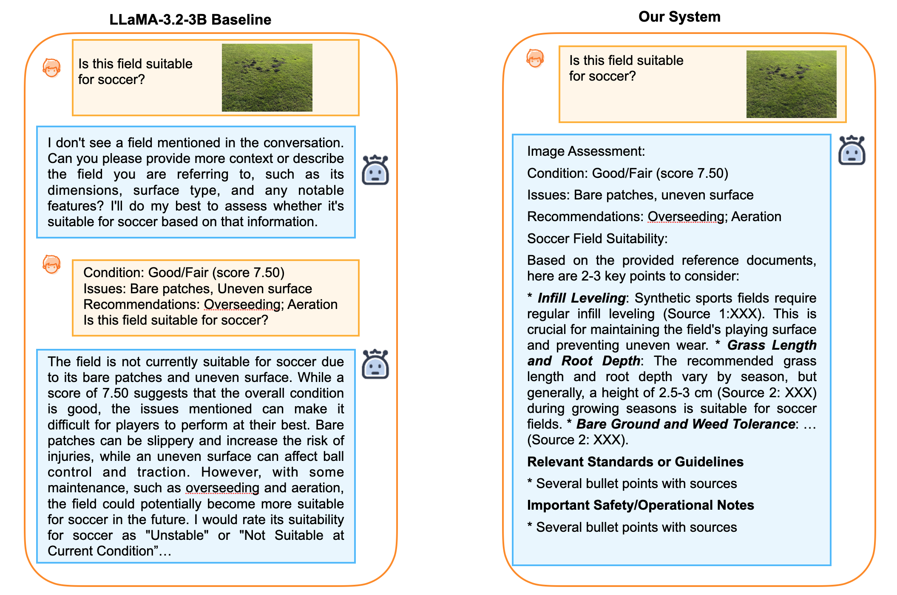

# 🌿 Urban Park Multimodal AI System

<p align="center">
  <b>A production-ready, domain-grounded multimodal AI assistant for urban park inspection and maintenance</b>
</p>

<p align="center">
  
  
  
  
  
</p>

---

## ✨ Overview

This project presents an **end-to-end multimodal AI system for municipal urban park management**, capable of understanding **natural language**, **structured maintenance data**, **domain documents**, and **field images** within a unified orchestration framework. It supports intelligent **field inspection**, **maintenance decision-making**, and **cost analytics** through a tightly coupled **NLU → Planner → Executor → Composer** pipeline.

> 🎓 Developed as the **Final Capstone Project** at Northeastern University (Vancouver, BC).
>


---

## ✨ Key Features

- **Multimodal Reasoning**: Unified processing of text queries, structured databases, maintenance documents, and field images.
- **Domain-Grounded Intelligence**: Retrieval-Augmented Generation (RAG) over curated municipal standards and SOPs.
- **Hybrid Analytics**: Deterministic SQL templates with LLM-based Text-to-SQL fallback.
- **Vision-Language Assessment**: Cloud-based VLM for automated field-condition analysis.
- **Local-First Architecture**: Local SQLite, FAISS, and Ollama LLM reduce cost, latency, and data exposure.
- **Rule-Guided Orchestration**: Deterministic planning ensures interpretability and governance readiness.
- **Automatic Visualization**: Line charts, bar charts, stacked views, and timelines generated per query.

---

## 🧠 System Architecture


The system follows a four-stage modular pipeline:

1. **NLU (Natural Language Understanding)**  
   Intent classification, entity extraction, and multimodal consistency validation.

2. **Planner (Execution Planning)**  
   Rule-guided template routing, parameter validation, and tool-chain generation.

3. **Executor (Tool Orchestration)**  
   Sequential execution of RAG, SQL, VLM, and fallback LLM tools with evidence tracking.

4. **Composer (Response Generation)**  
   Automated fusion of analytical, textual, and visual evidence into structured answers and charts.

This design separates understanding, planning, execution, and presentation for maintainability and extensibility.

---

## 🧩 Supported Query Types

| Category             | Example Queries                                      | Pipeline      |
| -------------------- | ---------------------------------------------------- | ------------- |
| 💰 Cost Analytics    | "Which park has the highest mowing cost?"            | SQL / RAG+SQL |
| 📋 Standards & SOP   | "What are soccer field size requirements?"           | RAG           |
| 🖼️ Field Inspection | "Is this field suitable for soccer?"                 | CV / RAG+CV   |
| 🧠 Hybrid Reasoning  | "Does this field need mowing based on cost & image?" | RAG+CV+SQL    |

---
## 🏆 Key Contributions

- **First municipal-focused multimodal maintenance assistant** integrating CV, RAG, and SQL analytics into a single interpretable pipeline.
- **Rule-guided orchestration over black-box agents**, enabling transparent, governance-ready execution.
- **Domain-grounded retrieval framework** that transforms a general LLM into a standards-aligned decision assistant.
- **Local-first deployment strategy** using FAISS, SQLite, and Ollama to achieve near-zero operational cost.
- **End-to-end multimodal reasoning** that unifies visual inspection, structured analytics, and policy documents.
---

## 📊 Evaluation Highlights

- **Intent Classification Accuracy**: 76% macro accuracy across 5 intent classes.
- **SQL Template Correctness**: 100% verified correctness.
- **RAG Faithfulness**: 0.97 generation faithfulness (near-zero hallucination).
- **CV Accuracy**: 70% overall accuracy across Good/Fair/Poor categories.
- **End-to-End Performance**:
  - Sub-second latency for SQL-only queries
  - ~1–3s for CV and RAG queries
  - ~9–14s for full RAG+CV multimodal chains
- **Cost Efficiency**: Local-first design enables near-zero operational cost in production.

---

## 🔍 End-to-End Baseline Comparison

> This comparison illustrates the qualitative gap between a general-purpose text-only LLM and our full multimodal, domain-grounded pipeline on the representative query: *“Is this field suitable for soccer?”*.

- **Baseline (LLaMA-3.2-3B)**: Cannot process images; produces generic, non-standardized judgments without maintenance citations.
- **Our System (CV + RAG + SQL)**: Integrates visual condition assessment with retrieved municipal standards to generate **actionable, citation-grounded recommendations**.

---
## 🏗️ Project Structure

```text
urban-park-multimodal-ai/
├── app.py                 # FastAPI backend entrypoint
├── nlu.py                 # Stage 1 – intent classification & slot filling
├── planner.py             # Stage 2 – execution plan & tool-chain routing
├── executor.py            # Stage 3 – tool orchestration (RAG / SQL / CV)
├── composer.py            # Stage 4 – answer formatting & chart config
├── config.py              # Global configuration and paths
├── rag.py                 # RAG pipeline (FAISS/BM25 over maintenance docs)
├── sql_tool.py            # Template-based SQL analytics over mowing data
├── cv_tool.py             # Vision–language assessment using cloud VLM
├── utils.py               # Shared helpers (logging, timing, formatting)
│
├── data/                  # Local data and vector index
│   ├── 6 Mowing Reports to Jun 20 2025.xlsx
│   ├── rag_docs/          # Domain documents for RAG
│   │   ├── mowing_standard.pdf
│   │   └── field_standards.txt
│   └── faiss_index/       # Auto-generated FAISS index (created at runtime)
│
├── experiment/            # Notebooks and evaluation scripts
│   └── data_prep/
│       └── convert_field_standards.py  # CSV → RAG document converter
│
├── parks-ui/              # React + Vite frontend
│   ├── src/
│   │   ├── App.jsx        # Chat-style UI + multimodal result viewer
│   │   ├── App.css        # Layout and theme
│   │   └── main.jsx
│   ├── package.json
│   └── vite.config.js
│
└── README.md              # Project overview and setup instructions
```

---


## ⚙️ Quick Start

### 1. Backend Setup

```bash
conda create -n capstone python=3.11
conda activate capstone
pip install -r requirements.txt
cp .env.example .env
```

Add your OpenRouter API key to `.env`:

```bash
OPENROUTER_API_KEY=sk-or-v1-your-key
```

Start server:

```bash
uvicorn app:app --reload --host 127.0.0.1 --port 8000
```

---

### 2. Frontend Setup

```bash
cd parks-ui
npm install
npm run dev
```

---

## 🔑 API Endpoints

| Endpoint | Function |
|----------|----------|
| `/nlu/parse` | Intent classification |
| `/plan/generate` | Execution planning |
| `/execute/run` | Tool orchestration |
| `/agent/answer` | **Main end-to-end pipeline** |
| `/debug/pipeline` | Stage-by-stage debugging |

---

## 🖼️ Vision–Language Model (VLM)

- Default Model: **Claude 3 Haiku (OpenRouter)**
- Functions:
  - Turf condition scoring
  - Surface defect detection
  - Maintenance prioritization

Low-cost and free alternatives are supported via Gemini Flash.

---

## 🧪 Example Query

```json
{
  "text": "Is this field suitable for U15 soccer?",
  "image_uri": "uploaded_image.jpg"
}
```

Returns:
- Visual condition assessment
- Field suitability decision
- Maintenance recommendations
- Cited standards

---

## 🛡️ Design Principles

- **Interpretability**: Rule-guided planning over opaque agents
- **Governance-Ready**: Deterministic SQL templates and citations
- **Resource-Aware**: Cloud models used only when necessary
- **Multimodal Evidence Fusion**: Vision + Documents + Data

---

## 📌 Deployment Notes

- Designed for **municipal-scale workloads**
- Supports local deployment for **privacy-preserving analytics**
- Scales to cloud when extended multimodal capacity is required

---

## 👥 Project Team

- Siyun He  
- Boyuan Sun  
- Jinghan Gao  
- Yibing Chen  

Northeastern University, Vancouver, BC, Canada

---

## 📜 License

For academic and demonstration use only.